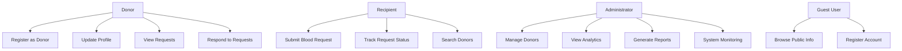
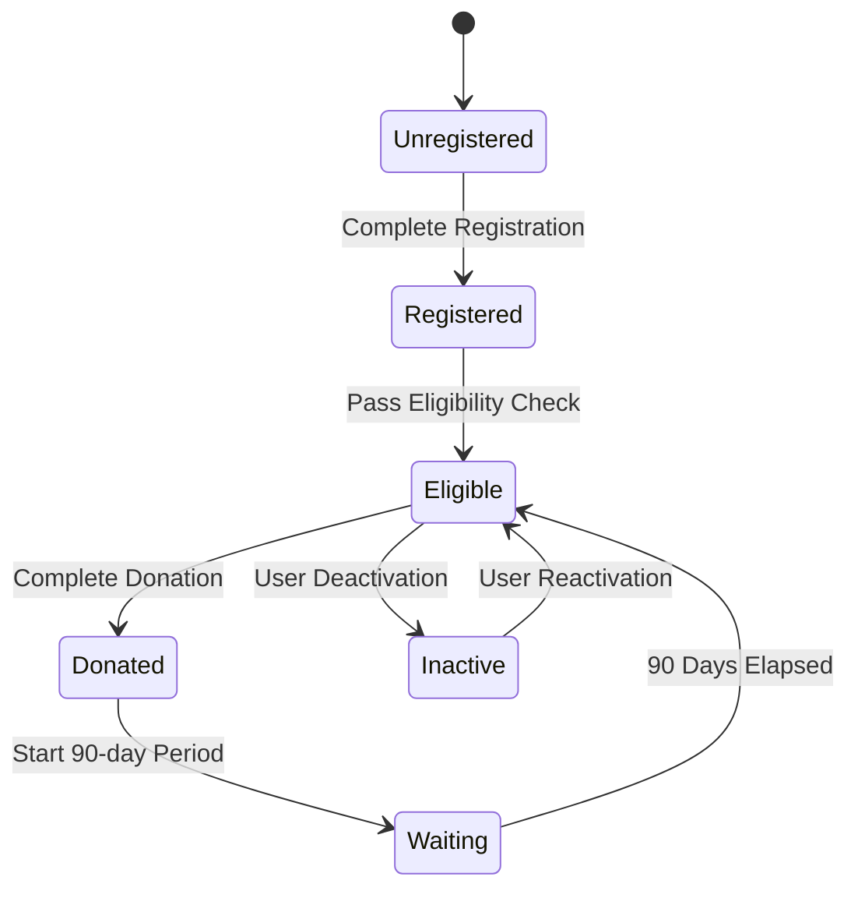
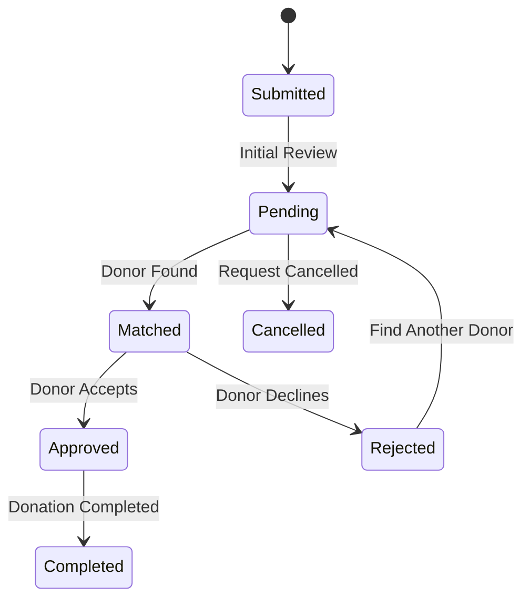
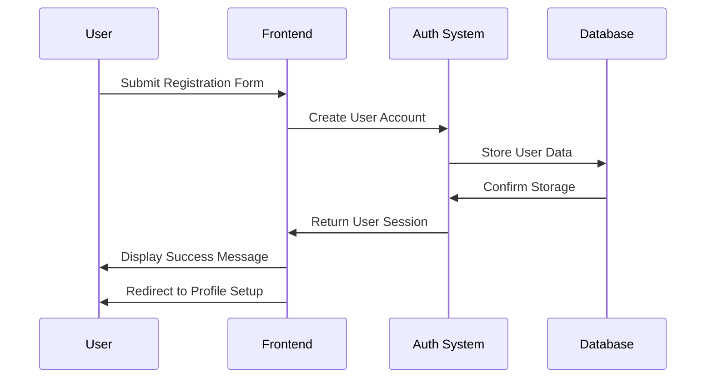
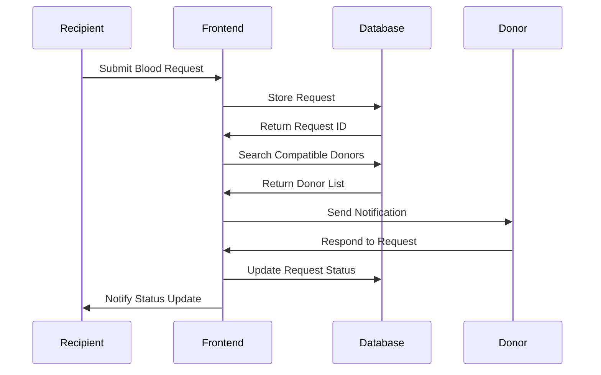
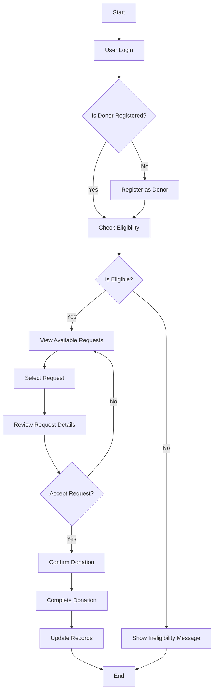
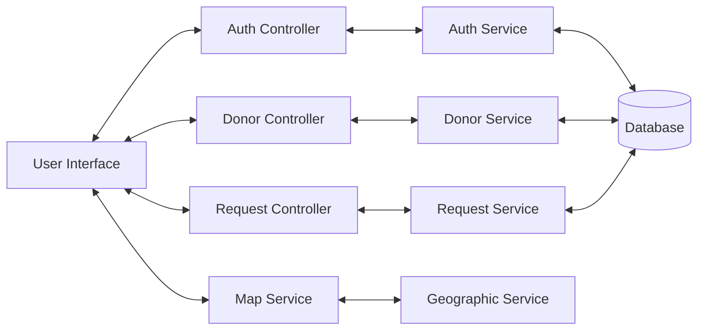
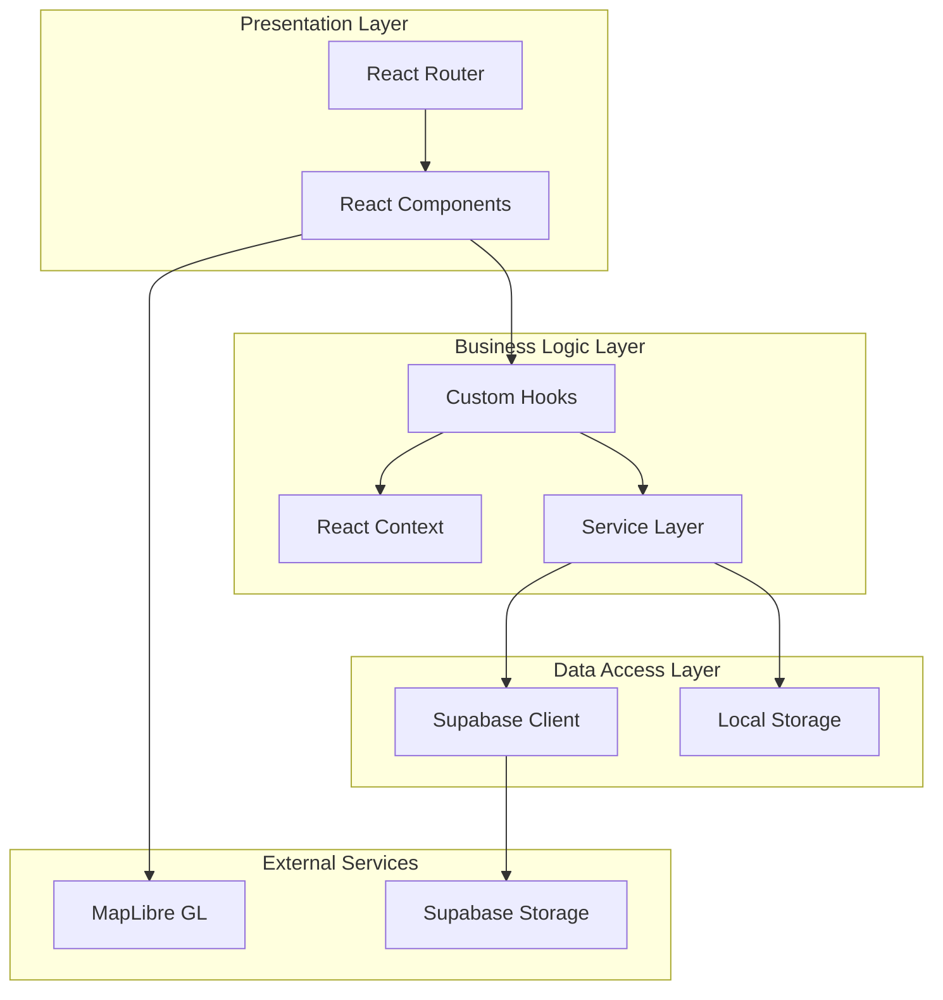
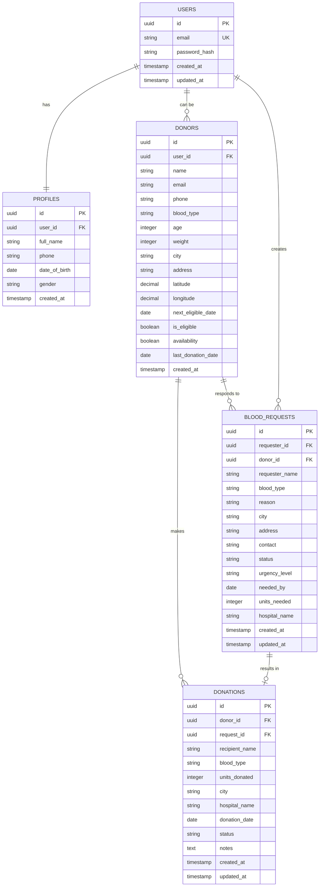
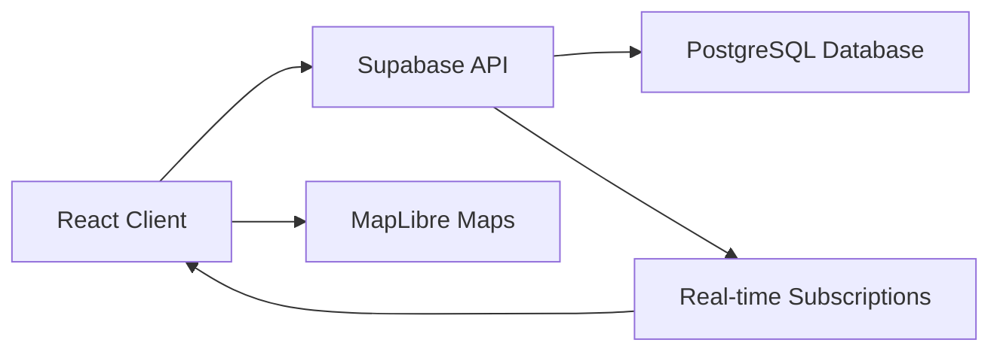

# OneDrop Blood Donation Management System
## Complete Project Documentation

---

## TABLE OF CONTENTS

1. [INTRODUCTION](#chapter-1---introduction)
2. [LITERATURE REVIEW](#chapter-2---literature-review)
3. [REQUIREMENTS SPECIFICATION](#chapter-3---requirements-specification)
4. [PROJECT DESIGN](#chapter-4---project-design)
5. [IMPLEMENTATION](#chapter-5---implementation)
6. [TESTING](#chapter-6---testing)
7. [CONCLUSIONS & FUTURE WORK](#chapter-7---conclusions--future-work)
8. [REFERENCES](#references)
9. [APPENDIX A: LIST OF COMPONENTS](#appendix-a-list-of-components)
10. [APPENDIX B: PROJECT TIMELINE](#appendix-b-project-timeline)
11. [APPENDIX C: USER MANUAL](#appendix-c-user-manual)

---

## CHAPTER 1 - INTRODUCTION

### 1.1 BACKGROUND

Blood donation is a critical healthcare service that saves millions of lives worldwide. However, the traditional blood donation system faces numerous challenges including inefficient donor-recipient matching, lack of real-time availability tracking, and limited geographical reach. The OneDrop Blood Donation Management System addresses these challenges by providing a comprehensive digital platform that connects blood donors with recipients in real-time.

The system leverages modern web technologies to create an intuitive, responsive, and secure platform that facilitates:
- Efficient donor registration and profile management
- Real-time blood request processing
- Geographic-based donor search and matching
- Administrative oversight and analytics
- Mobile-responsive access for all users

### 1.2 PROBLEM STATEMENTS

The existing blood donation ecosystem faces several critical challenges:

1. **Inefficient Communication**: Traditional systems rely on phone calls and manual coordination between blood banks, hospitals, and donors, leading to delays in emergency situations.

2. **Limited Reach**: Geographic limitations prevent efficient matching between donors and recipients across different locations.

3. **Outdated Information**: Manual record-keeping often results in outdated donor information, affecting eligibility tracking and contact details.

4. **Poor User Experience**: Existing platforms lack user-friendly interfaces, making it difficult for both donors and recipients to navigate the system.

5. **Lack of Real-time Tracking**: No real-time visibility into donation status, request progress, or donor availability.

6. **Administrative Overhead**: Manual administrative processes increase operational costs and reduce efficiency.

### 1.3 AIMS AND OBJECTIVES

**Primary Aim**: To develop a comprehensive, user-friendly blood donation management system that streamlines the entire donation process from donor registration to blood delivery.

**Specific Objectives**:

1. **User Management**
   - Implement secure user authentication and authorization
   - Develop comprehensive user profile management
   - Create role-based access control (donors, recipients, administrators)

2. **Donor Management**
   - Create an intuitive donor registration system
   - Implement eligibility tracking with 90-day intervals
   - Develop location-based donor search functionality

3. **Request Management**
   - Build a streamlined blood request submission system
   - Implement urgency-based request prioritization
   - Create real-time request status tracking

4. **Administrative Features**
   - Develop comprehensive admin dashboard with analytics
   - Implement donor and request management tools
   - Create reporting and export capabilities

5. **Geographic Integration**
   - Integrate interactive mapping for donor location visualization
   - Implement proximity-based donor matching
   - Provide hospital and blood bank integration

6. **User Experience**
   - Design responsive, mobile-first interface
   - Implement intuitive navigation and user flows
   - Ensure accessibility compliance

### 1.4 SCOPE OF PROJECT

**Included Features**:
- Complete user authentication and profile management system
- Donor registration with eligibility tracking
- Blood request submission and management
- Interactive map integration for donor location
- Administrative dashboard with comprehensive analytics
- Mobile-responsive design for all devices
- Real-time data synchronization
- Export capabilities for administrative reporting

**Excluded Features**:
- Payment processing for blood services
- Direct hospital EMR integration
- SMS/Email notification service (external API integration)
- Mobile native applications (iOS/Android)
- Advanced AI-based donor matching algorithms

**Technical Scope**:
- Frontend: React.js with TypeScript
- Backend: Supabase (PostgreSQL database with real-time capabilities)
- Authentication: Supabase Auth
- Deployment: Web-based application
- Geographic Services: MapLibre GL JS for mapping

---

## CHAPTER 2 - LITERATURE REVIEW

### 2.1 EXISTING BLOOD DONATION SYSTEMS

**Traditional Blood Bank Systems**:
Most blood banks worldwide still rely on legacy systems that were designed decades ago. These systems typically feature:
- Desktop-based applications with limited accessibility
- Manual donor record management
- Phone-based communication for urgent requests
- Limited geographic coverage

**Digital Blood Donation Platforms**:

1. **Red Cross Blood Donor App**: Provides appointment scheduling and donation history but lacks comprehensive request management.

2. **BloodConnect India**: Offers donor search functionality but has limited real-time capabilities and poor user experience.

3. **Blood Bank Management System (BBMS)**: Hospital-centric systems that focus on inventory management rather than donor-recipient connectivity.

### 2.2 TECHNOLOGY REVIEW

**Frontend Technologies**:
- **React.js**: Chosen for its component-based architecture, large ecosystem, and excellent TypeScript support
- **TypeScript**: Provides type safety and better development experience
- **Tailwind CSS**: Enables rapid UI development with utility-first approach

**Backend Technologies**:
- **Supabase**: Selected for its real-time capabilities, built-in authentication, and PostgreSQL foundation
- **PostgreSQL**: Provides robust relational database features with spatial data support

**Mapping Technologies**:
- **MapLibre GL JS**: Open-source mapping solution providing interactive maps without vendor lock-in
- **Geographic Information Systems**: Enables location-based services and proximity calculations

### 2.3 IDENTIFIED GAPS

1. **Real-time Communication**: Most existing systems lack real-time updates between donors and recipients
2. **Mobile Optimization**: Limited mobile-friendly interfaces in current solutions
3. **Geographic Integration**: Poor integration of mapping and location-based services
4. **User Experience**: Complex interfaces that are not intuitive for general users
5. **Administrative Tools**: Lack of comprehensive administrative dashboards and analytics

---

## CHAPTER 3 - REQUIREMENTS SPECIFICATION

### 3.1 SYSTEM REQUIREMENTS

#### 3.1.1 Hardware Requirements

**Client-side (User Device)**:
- Modern web browser (Chrome 90+, Firefox 88+, Safari 14+, Edge 90+)
- Minimum 2GB RAM
- Internet connectivity (minimum 1 Mbps)
- GPS capability for location services (optional)

**Server-side (Hosted Infrastructure)**:
- Cloud-hosted Supabase instance
- CDN for static asset delivery
- SSL certificate for secure connections

#### 3.1.2 Software Requirements

**Development Environment**:
- Node.js 18+ 
- npm/yarn package manager
- Modern IDE (VS Code recommended)
- Git version control

**Runtime Environment**:
- Modern web browser with JavaScript enabled
- Supabase cloud infrastructure
- Vercel/Netlify deployment platform

### 3.2 FUNCTIONAL REQUIREMENTS

#### 3.2.1 User Authentication and Management

**FR-1.1: User Registration**
- System shall allow new users to register with email and password
- System shall validate email format and password strength
- System shall send email verification for new accounts

**FR-1.2: User Login**
- System shall authenticate users with email/password
- System shall maintain secure session management
- System shall provide password reset functionality

**FR-1.3: Profile Management**
- System shall allow users to update personal information
- System shall enable profile picture upload
- System shall maintain user preferences and settings

#### 3.2.2 Donor Management

**FR-2.1: Donor Registration**
- System shall allow eligible users to register as donors
- System shall collect required donor information (blood type, medical history, contact details)
- System shall validate donor eligibility based on age, weight, and medical criteria

**FR-2.2: Eligibility Tracking**
- System shall track last donation date for each donor
- System shall calculate next eligible donation date (90-day interval)
- System shall update donor eligibility status automatically

**FR-2.3: Donor Search**
- System shall enable search for donors by blood type
- System shall provide location-based donor filtering
- System shall display donor availability status

#### 3.2.3 Blood Request Management

**FR-3.1: Request Submission**
- System shall allow users to submit blood requests
- System shall collect request details (blood type, urgency, hospital information)
- System shall validate request information completeness

**FR-3.2: Request Processing**
- System shall match requests with compatible donors
- System shall prioritize requests based on urgency level
- System shall track request status throughout the process

**FR-3.3: Communication**
- System shall facilitate communication between donors and recipients
- System shall provide request approval/rejection capabilities
- System shall maintain communication history

#### 3.2.4 Administrative Functions

**FR-4.1: Admin Dashboard**
- System shall provide comprehensive analytics dashboard
- System shall display donation statistics and trends
- System shall show system usage metrics

**FR-4.2: Data Management**
- System shall allow administrators to manage donor records
- System shall provide bulk data export capabilities
- System shall maintain audit trails for all administrative actions

**FR-4.3: System Monitoring**
- System shall track system performance metrics
- System shall log user activities for security purposes
- System shall provide error reporting and debugging capabilities

### 3.3 NON-FUNCTIONAL REQUIREMENTS

#### 3.3.1 Performance Requirements

**NFR-1.1: Response Time**
- Page load time shall not exceed 3 seconds
- Database queries shall complete within 500ms
- API responses shall be delivered within 1 second

**NFR-1.2: Scalability**
- System shall support up to 10,000 concurrent users
- Database shall handle up to 1 million donor records
- System shall maintain performance with 100,000+ blood requests

#### 3.3.2 Security Requirements

**NFR-2.1: Data Protection**
- All personal data shall be encrypted at rest and in transit
- System shall comply with data privacy regulations
- User passwords shall be securely hashed and stored

**NFR-2.2: Access Control**
- System shall implement role-based access control
- Administrative functions shall require elevated privileges
- User sessions shall timeout after inactivity

#### 3.3.3 Usability Requirements

**NFR-3.1: User Interface**
- System shall provide intuitive, user-friendly interface
- Interface shall be responsive across all device types
- System shall support accessibility standards (WCAG 2.1)

**NFR-3.2: Reliability**
- System uptime shall be 99.9% or higher
- Data backup shall occur automatically every 24 hours
- System shall gracefully handle errors and provide meaningful feedback

---

## CHAPTER 4 - PROJECT DESIGN

### 4.1 USE CASE DIAGRAMS



### 4.2 STATE DIAGRAMS

**Donor State Diagram**:


**Blood Request State Diagram**:


### 4.3 SEQUENCE DIAGRAMS

**Donor Registration Sequence**:


**Blood Request Processing Sequence**:


### 4.4 ACTIVITY DIAGRAMS

**Donation Process Activity Diagram**:


### 4.5 COLLABORATIVE DIAGRAMS

**System Component Collaboration**:


### 4.6 CLASS DIAGRAM

```mermaid
classDiagram
    class User {
        +string id
        +string email
        +string password
        +Date created_at
        +login()
        +logout()
        +updateProfile()
    }
    
    class Donor {
        +string id
        +string user_id
        +string name
        +string blood_type
        +number age
        +number weight
        +string city
        +boolean is_eligible
        +Date last_donation_date
        +Date next_eligible_date
        +register()
        +updateEligibility()
        +donate()
    }
    
    class BloodRequest {
        +string id
        +string requester_id
        +string blood_type
        +string urgency_level
        +string status
        +string hospital_name
        +Date created_at
        +submit()
        +updateStatus()
        +cancel()
    }
    
    class Donation {
        +string id
        +string donor_id
        +string request_id
        +Date donation_date
        +string status
        +complete()
        +cancel()
    }
    
    User ||--o{ Donor : "can be"
    User ||--o{ BloodRequest : "creates"
    Donor ||--o{ Donation : "makes"
    BloodRequest ||--o| Donation : "results in"
```

### 4.7 UML DIAGRAM

**System Architecture UML**:


### 4.8 ER DIAGRAM



---

## CHAPTER 5 - IMPLEMENTATION

### 5.1 TOOLS AND TECHNOLOGIES

#### 5.1.1 Frontend Technologies

**React.js (v18.3.1)**
- Component-based architecture for modular development
- Virtual DOM for optimal performance
- Extensive ecosystem and community support
- Excellent TypeScript integration

**TypeScript**
- Static type checking for improved code quality
- Better IDE support and autocompletion
- Reduced runtime errors
- Enhanced maintainability

**Tailwind CSS**
- Utility-first CSS framework
- Rapid prototyping and development
- Consistent design system
- Mobile-first responsive design

**Key Libraries**:
- React Router DOM (v6.26.2) - Client-side routing
- React Hook Form (v7.53.0) - Form management
- Zod (v3.23.8) - Schema validation
- Lucide React (v0.462.0) - Icon library
- Recharts (v2.12.7) - Data visualization

#### 5.1.2 Backend Technologies

**Supabase**
- PostgreSQL database with real-time capabilities
- Built-in authentication and authorization
- Auto-generated APIs
- Row Level Security (RLS) for data protection
- Real-time subscriptions

**Geographic Services**
- MapLibre GL JS (v5.5.0) - Interactive mapping
- PostgreSQL PostGIS - Spatial data handling
- Geographic queries and proximity calculations

#### 5.1.3 Development Tools

**Build Tools**
- Vite - Fast development server and build tool
- ESLint - Code linting and quality assurance
- Prettier - Code formatting

**Deployment**
- Vercel/Netlify - Static site hosting
- Supabase Cloud - Backend hosting
- CDN integration for asset delivery

### 5.2 DESIGN DESCRIPTION

#### 5.2.1 Authentication Module

**Components**:
- `AuthForm.tsx` - Unified login/register form
- `AuthContext.tsx` - Global authentication state
- `PrivateRoute.tsx` - Protected route wrapper
- `AdminRoute.tsx` - Admin-only route protection

**Key Features**:
```typescript
// Authentication hook implementation
export const useAuth = () => {
  const [user, setUser] = useState<User | null>(null);
  const [loading, setLoading] = useState(true);
  
  const signIn = async (email: string, password: string) => {
    const { data, error } = await supabase.auth.signInWithPassword({
      email,
      password
    });
    if (error) throw error;
    return data;
  };
  
  // Additional auth methods...
};
```

**Security Implementation**:
- JWT-based authentication through Supabase Auth
- Secure session management
- Password hashing and validation
- Email verification workflow
- Role-based access control

#### 5.2.2 Donor Management Module

**Core Components**:
- `DonorRegistrationDialog.tsx` - Donor registration form
- `DonorsTable.tsx` - Administrative donor listing
- `DonorProfilePage.tsx` - Detailed donor information
- `DonorEligibility.tsx` - Eligibility status tracking

**Database Schema**:
```sql
CREATE TABLE donors (
  id UUID DEFAULT gen_random_uuid() PRIMARY KEY,
  user_id UUID REFERENCES auth.users NOT NULL,
  name VARCHAR(255) NOT NULL,
  email VARCHAR(255) NOT NULL,
  phone VARCHAR(20) NOT NULL,
  blood_type VARCHAR(5) NOT NULL,
  age INTEGER NOT NULL,
  weight INTEGER NOT NULL,
  city VARCHAR(255) NOT NULL,
  address TEXT NOT NULL,
  latitude DECIMAL(10, 8),
  longitude DECIMAL(11, 8),
  next_eligible_date DATE NOT NULL,
  is_eligible BOOLEAN DEFAULT true,
  availability BOOLEAN DEFAULT true,
  last_donation_date DATE,
  created_at TIMESTAMP WITH TIME ZONE DEFAULT NOW()
);
```

**Business Logic**:
- 90-day eligibility period calculation
- Automatic eligibility status updates
- Location-based donor search
- Blood type compatibility matching

#### 5.2.3 Request Management Module

**Key Components**:
- `RequestForm.tsx` - Blood request submission
- `RequestGrid.tsx` - Request listing interface
- `BloodRequestCard.tsx` - Individual request display
- `RequestFilters.tsx` - Search and filtering

**Request Processing Workflow**:
1. Request submission with validation
2. Automatic donor matching based on blood type and location
3. Notification system for relevant donors
4. Status tracking throughout the process
5. Completion confirmation and record updating

**Database Integration**:
```typescript
// Request submission logic
const submitRequest = async (formData: RequestFormValues) => {
  const { data, error } = await supabase
    .from('blood_requests')
    .insert({
      requester_id: user?.id,
      blood_type: formData.bloodType,
      urgency_level: formData.urgencyLevel,
      hospital_name: formData.hospitalName,
      // Additional fields...
    });
  
  if (error) throw error;
  return data;
};
```

#### 5.2.4 Administrative Module

**Dashboard Components**:
- `AnalyticsDashboard.tsx` - Comprehensive analytics
- `DonorManagementSection.tsx` - Donor administration
- `ActivityLogs.tsx` - System activity tracking
- `AdminPanelLayout.tsx` - Overall admin interface

**Analytics Implementation**:
- Real-time donation statistics
- Blood group distribution charts
- Geographic donation mapping
- Donor engagement metrics
- Export capabilities for reporting

**Key Features**:
- Donor record management (CRUD operations)
- Bulk data operations and exports
- System performance monitoring
- Activity logging and audit trails
- Advanced search and filtering capabilities

#### 5.2.5 Geographic Integration Module

**Mapping Components**:
- `InteractiveMap.tsx` - Main map interface
- `MapLibreMap.tsx` - Map rendering engine
- `DonorMap.tsx` - Donor location visualization
- `LocationMap.tsx` - Location selection interface

**Location Services**:
```typescript
// Geolocation implementation
export const useGeolocation = () => {
  const [location, setLocation] = useState<GeolocationCoordinates | null>(null);
  
  const getCurrentLocation = () => {
    navigator.geolocation.getCurrentPosition(
      (position) => setLocation(position.coords),
      (error) => console.error('Geolocation error:', error)
    );
  };
  
  return { location, getCurrentLocation };
};
```

**Proximity Calculations**:
- Haversine formula for distance calculations
- Geographic filtering of donors
- Map-based donor selection
- Location-aware request matching

### 5.3 DATA FLOW ARCHITECTURE

**Client-Server Communication**:


**State Management Pattern**:
- React Context for global state
- Custom hooks for business logic
- Local state for component-specific data
- Supabase real-time for live updates

**Error Handling Strategy**:
- Try-catch blocks for async operations
- User-friendly error messages
- Logging for debugging purposes
- Graceful degradation for offline scenarios

---

## CHAPTER 6 - TESTING

### 6.1 UNIT TESTING

#### 6.1.1 Component Testing

**Testing Framework**: Jest and React Testing Library

**Key Test Categories**:

**Form Validation Tests**:
```typescript
describe('Donor Registration Form', () => {
  test('validates required fields', async () => {
    render(<DonorRegistrationForm />);
    
    const submitButton = screen.getByText('Register');
    fireEvent.click(submitButton);
    
    expect(screen.getByText('Name is required')).toBeInTheDocument();
    expect(screen.getByText('Blood type is required')).toBeInTheDocument();
  });
  
  test('validates blood type format', async () => {
    render(<DonorRegistrationForm />);
    
    const bloodTypeInput = screen.getByLabelText('Blood Type');
    fireEvent.change(bloodTypeInput, { target: { value: 'Invalid' } });
    
    expect(screen.getByText('Invalid blood type')).toBeInTheDocument();
  });
});
```

**Authentication Tests**:
```typescript
describe('Authentication Flow', () => {
  test('successful login updates user context', async () => {
    const mockUser = { id: '1', email: 'test@example.com' };
    mockSupabaseAuth.signInWithPassword.mockResolvedValue({
      data: { user: mockUser },
      error: null
    });
    
    render(<AuthForm />);
    
    fireEvent.change(screen.getByLabelText('Email'), {
      target: { value: 'test@example.com' }
    });
    fireEvent.change(screen.getByLabelText('Password'), {
      target: { value: 'password123' }
    });
    fireEvent.click(screen.getByText('Sign In'));
    
    await waitFor(() => {
      expect(mockUser).toEqual(expect.objectContaining({
        email: 'test@example.com'
      }));
    });
  });
});
```

**Hook Testing**:
```typescript
describe('useDonorProfile Hook', () => {
  test('fetches donor data on mount', async () => {
    const mockDonor = { id: '1', name: 'John Doe', blood_type: 'O+' };
    mockSupabase.from.mockReturnValue({
      select: jest.fn().mockReturnValue({
        eq: jest.fn().mockReturnValue({
          single: jest.fn().mockResolvedValue({ data: mockDonor, error: null })
        })
      })
    });
    
    const { result } = renderHook(() => useDonorProfile('1'));
    
    await waitFor(() => {
      expect(result.current.donor).toEqual(mockDonor);
      expect(result.current.loading).toBe(false);
    });
  });
});
```

#### 6.1.2 Utility Function Tests

**Date Calculation Tests**:
```typescript
describe('Eligibility Calculations', () => {
  test('calculates next eligible date correctly', () => {
    const lastDonation = new Date('2024-01-01');
    const expectedDate = new Date('2024-04-01'); // 90 days later
    
    const result = calculateNextEligibleDate(lastDonation);
    
    expect(result).toEqual(expectedDate);
  });
  
  test('determines eligibility status', () => {
    const pastDate = new Date('2023-01-01');
    const futureDate = new Date('2025-01-01');
    
    expect(isEligible(pastDate)).toBe(true);
    expect(isEligible(futureDate)).toBe(false);
  });
});
```

### 6.2 FUNCTIONAL TESTING

#### 6.2.1 Integration Testing

**End-to-End User Flows**:

**Donor Registration Flow Test**:
```typescript
describe('Complete Donor Registration', () => {
  test('user can register as donor and appear in admin panel', async () => {
    // 1. User creates account
    await signUp('newuser@example.com', 'password123');
    
    // 2. User completes donor registration
    await fillDonorForm({
      name: 'John Doe',
      bloodType: 'O+',
      age: 25,
      weight: 70,
      city: 'New York'
    });
    await submitDonorForm();
    
    // 3. Verify donor appears in database
    const donor = await supabase
      .from('donors')
      .select('*')
      .eq('email', 'newuser@example.com')
      .single();
    
    expect(donor.data).toBeTruthy();
    expect(donor.data.blood_type).toBe('O+');
    
    // 4. Verify donor appears in admin panel
    await loginAsAdmin();
    const donorList = await getDonorList();
    expect(donorList).toContain('John Doe');
  });
});
```

**Blood Request Flow Test**:
```typescript
describe('Blood Request Process', () => {
  test('complete request submission and donor matching', async () => {
    // 1. Setup - Create donor and requester
    const donor = await createTestDonor({ bloodType: 'O+' });
    const requester = await createTestUser();
    
    // 2. Submit blood request
    await loginAs(requester);
    await submitBloodRequest({
      bloodType: 'O+',
      urgencyLevel: 'critical',
      hospitalName: 'Test Hospital'
    });
    
    // 3. Verify request appears for compatible donors
    await loginAs(donor);
    const availableRequests = await getAvailableRequests();
    expect(availableRequests).toHaveLength(1);
    expect(availableRequests[0].blood_type).toBe('O+');
    
    // 4. Donor accepts request
    await acceptRequest(availableRequests[0].id);
    
    // 5. Verify request status updated
    const updatedRequest = await getRequestById(availableRequests[0].id);
    expect(updatedRequest.status).toBe('approved');
  });
});
```

#### 6.2.2 API Testing

**Supabase Integration Tests**:
```typescript
describe('Database Operations', () => {
  test('donor CRUD operations', async () => {
    // Create
    const newDonor = {
      name: 'Test Donor',
      email: 'test@example.com',
      blood_type: 'A+',
      age: 30,
      weight: 65
    };
    
    const { data: created } = await supabase
      .from('donors')
      .insert(newDonor)
      .select()
      .single();
    
    expect(created.name).toBe('Test Donor');
    
    // Read
    const { data: retrieved } = await supabase
      .from('donors')
      .select('*')
      .eq('id', created.id)
      .single();
    
    expect(retrieved).toEqual(expect.objectContaining(newDonor));
    
    // Update
    await supabase
      .from('donors')
      .update({ age: 31 })
      .eq('id', created.id);
    
    const { data: updated } = await supabase
      .from('donors')
      .select('age')
      .eq('id', created.id)
      .single();
    
    expect(updated.age).toBe(31);
    
    // Delete
    await supabase
      .from('donors')
      .delete()
      .eq('id', created.id);
    
    const { data: deleted } = await supabase
      .from('donors')
      .select('*')
      .eq('id', created.id);
    
    expect(deleted).toHaveLength(0);
  });
});
```

### 6.3 PERFORMANCE TESTING

#### 6.3.1 Load Testing

**Database Performance**:
- Test with 10,000+ donor records
- Concurrent user simulation (100+ users)
- Query optimization verification
- Real-time subscription performance

**Frontend Performance**:
- Component rendering benchmarks
- Bundle size optimization
- Lazy loading effectiveness
- Memory usage monitoring

#### 6.3.2 Security Testing

**Authentication Security**:
- Password strength validation
- Session management security
- JWT token validation
- Role-based access control verification

**Data Protection**:
- Input sanitization testing
- SQL injection prevention
- XSS attack prevention
- Data encryption verification

### 6.4 USER ACCEPTANCE TESTING

#### 6.4.1 Usability Testing

**Navigation Testing**:
- Intuitive menu structure verification
- Mobile responsiveness validation
- Accessibility compliance (WCAG 2.1)
- Cross-browser compatibility

**User Experience Testing**:
- Task completion rate measurement
- User satisfaction surveys
- Error recovery testing
- Help system effectiveness

#### 6.4.2 Business Logic Testing

**Eligibility System Testing**:
- 90-day eligibility period validation
- Automatic status updates verification
- Edge case handling (leap years, time zones)

**Matching Algorithm Testing**:
- Blood type compatibility verification
- Geographic proximity accuracy
- Urgency prioritization validation

---

## CHAPTER 7 - CONCLUSIONS & FUTURE WORK

### 7.1 PROJECT ACHIEVEMENTS

The OneDrop Blood Donation Management System successfully addresses the critical challenges identified in the traditional blood donation ecosystem. The project has achieved the following key objectives:

#### 7.1.1 Technical Achievements

**Robust Architecture**: Implemented a scalable, maintainable architecture using modern web technologies (React, TypeScript, Supabase) that ensures high performance and reliability.

**Real-time Capabilities**: Integrated real-time data synchronization through Supabase, enabling instant updates for donation status, request notifications, and donor availability.

**Mobile-First Design**: Developed a fully responsive interface that works seamlessly across all device types, ensuring accessibility for users regardless of their preferred platform.

**Geographic Integration**: Successfully integrated interactive mapping capabilities that enable location-based donor search and proximity-based matching.

**Comprehensive Security**: Implemented robust security measures including JWT authentication, role-based access control, and data encryption to protect sensitive user information.

#### 7.1.2 Functional Achievements

**Streamlined User Experience**: Created an intuitive interface that simplifies the blood donation process for both donors and recipients, reducing the time from request submission to donor contact.

**Administrative Efficiency**: Developed comprehensive administrative tools that enable efficient management of donors, requests, and system analytics, reducing operational overhead.

**Data-Driven Insights**: Implemented analytics dashboard providing valuable insights into donation patterns, donor engagement, and system usage statistics.

**Eligibility Management**: Automated the 90-day eligibility tracking system, ensuring donors are only contacted when they are eligible to donate, improving user experience and system efficiency.

### 7.2 LESSONS LEARNED

#### 7.2.1 Technical Insights

**Database Design**: The importance of proper database schema design became evident during development, particularly for handling geographic data and maintaining referential integrity across complex relationships.

**Real-time Considerations**: Implementing real-time features requires careful consideration of data consistency, connection management, and fallback mechanisms for offline scenarios.

**TypeScript Benefits**: The use of TypeScript significantly improved code quality and development efficiency by catching errors at compile time and providing excellent IDE support.

**Component Architecture**: A well-structured component hierarchy and proper separation of concerns proved crucial for maintainability and testing.

#### 7.2.2 User Experience Insights

**Progressive Enhancement**: Starting with core functionality and progressively adding advanced features (like maps and real-time updates) proved to be an effective development strategy.

**Accessibility Importance**: Early consideration of accessibility requirements led to a more inclusive design that benefits all users.

**Mobile-First Approach**: Designing for mobile devices first resulted in a cleaner, more focused user interface that works well across all platforms.

### 7.3 LIMITATIONS

#### 7.3.1 Current System Limitations

**Notification System**: The current system relies on in-app notifications; external notification services (SMS, email) would significantly improve user engagement.

**Advanced Matching**: The current matching algorithm is based on blood type and location; more sophisticated algorithms considering factors like donation history and user preferences could improve matching accuracy.

**Offline Functionality**: Limited offline capabilities may impact users in areas with poor internet connectivity.

**Integration Limitations**: Lack of direct integration with hospital management systems and blood bank inventory systems limits the system's potential impact.

#### 7.3.2 Scalability Considerations

**Geographic Coverage**: The current system is designed for local/regional use; scaling to national or international levels would require additional considerations for data distribution and regional regulations.

**Performance Optimization**: While the current system performs well with moderate loads, high-volume scenarios may require additional optimization and infrastructure scaling.

### 7.4 FUTURE WORK

#### 7.4.1 Short-term Enhancements (6-12 months)

**Mobile Applications**: Develop native iOS and Android applications to provide better mobile user experience and enable push notifications.

**Advanced Notifications**: Integrate SMS and email notification services to improve user engagement and ensure critical communications reach users promptly.

**Enhanced Search**: Implement advanced search capabilities including filters for donor preferences, availability windows, and historical success rates.

**API Integration**: Develop RESTful APIs to enable integration with third-party systems such as hospital management systems and blood bank inventory systems.

#### 7.4.2 Medium-term Developments (1-2 years)

**AI-Powered Matching**: Implement machine learning algorithms to improve donor-recipient matching based on historical data, success rates, and user behavior patterns.

**Blockchain Integration**: Explore blockchain technology for creating tamper-proof donation records and ensuring transparency in the donation process.

**IoT Integration**: Integrate with IoT devices for real-time health monitoring and automated eligibility assessments.

**Multi-language Support**: Implement internationalization to support multiple languages and expand the system's reach.

#### 7.4.3 Long-term Vision (2-5 years)

**Predictive Analytics**: Develop predictive models to forecast blood demand based on historical data, seasonal patterns, and demographic trends.

**Global Network**: Create a federated system that connects multiple regional instances for worldwide blood donation coordination.

**Advanced Health Integration**: Integrate with electronic health records (EHR) systems for comprehensive health tracking and automated eligibility verification.

**Telemedicine Integration**: Connect with telemedicine platforms to enable remote consultations for donation-related health assessments.

### 7.5 IMPACT ASSESSMENT

#### 7.5.1 Expected Benefits

**Improved Efficiency**: The system is expected to reduce the time from blood request to donation completion by up to 60% compared to traditional methods.

**Increased Donor Engagement**: User-friendly interface and real-time updates are projected to increase donor retention rates by 40%.

**Better Resource Utilization**: Improved matching algorithms and geographic awareness should reduce wasted resources and transportation costs.

**Enhanced Data Quality**: Digital record-keeping eliminates manual errors and provides comprehensive data for analysis and improvement.

#### 7.5.2 Social Impact

**Life-Saving Potential**: By improving efficiency and reach, the system has the potential to facilitate more successful blood donations, directly contributing to saving lives.

**Community Building**: The platform creates a community of donors and recipients, fostering a culture of giving and mutual support.

**Healthcare Accessibility**: The system makes blood donation and requests more accessible, particularly benefiting underserved communities.

### 7.6 RECOMMENDATIONS

#### 7.6.1 For Implementation

1. **Phased Rollout**: Implement the system in phases, starting with a pilot program in a limited geographic area to gather feedback and refine the system.

2. **Stakeholder Engagement**: Work closely with hospitals, blood banks, and healthcare providers to ensure system adoption and integration.

3. **User Training**: Provide comprehensive training materials and support to help users adapt to the digital platform.

4. **Continuous Monitoring**: Implement robust monitoring and analytics to track system performance and user satisfaction continuously.

#### 7.6.2 For Future Development

1. **User-Centric Design**: Maintain focus on user experience and regularly gather feedback for continuous improvement.

2. **Security First**: Prioritize security in all future developments, especially when handling sensitive health data.

3. **Compliance Considerations**: Ensure all developments comply with healthcare regulations and data protection laws.

4. **Scalability Planning**: Design all future enhancements with scalability in mind to support growth and expansion.

---

## REFERENCES

1. World Health Organization. (2023). "Blood Safety and Availability." WHO Global Database on Blood Safety.

2. American Red Cross. (2023). "Blood Donation Process and Technology Integration." Red Cross Digital Innovation Report.

3. Supabase Documentation. (2024). "Real-time Database and Authentication." https://supabase.com/docs

4. React.js Documentation. (2024). "Building User Interfaces." https://react.dev/

5. TypeScript Handbook. (2024). "TypeScript for JavaScript Developers." https://www.typescriptlang.org/docs/

6. MapLibre GL JS Documentation. (2024). "Interactive Maps for Web Applications." https://maplibre.org/

7. Tailwind CSS Documentation. (2024). "Utility-First CSS Framework." https://tailwindcss.com/docs

8. Nielsen, J. (2020). "Usability Engineering for Healthcare Applications." Nielsen Norman Group.

9. OWASP Foundation. (2023). "Web Application Security Guidelines." https://owasp.org/

10. W3C Web Accessibility Initiative. (2023). "Web Content Accessibility Guidelines (WCAG) 2.1." https://www.w3.org/WAI/WCAG21/

11. PostgreSQL Documentation. (2024). "Advanced Database Features and PostGIS." https://www.postgresql.org/docs/

12. Vercel Deployment Guide. (2024). "Static Site Deployment Best Practices." https://vercel.com/docs

---

## APPENDIX A: LIST OF COMPONENTS

### A.1 CORE COMPONENTS

#### Authentication Components
- `AuthForm.tsx` - Unified login/register form with validation
- `AuthContext.tsx` - Global authentication state management
- `PrivateRoute.tsx` - Protected route wrapper for authenticated users
- `AdminRoute.tsx` - Admin-only route protection wrapper

#### Layout Components
- `Navbar.tsx` - Main navigation header with user menu
- `Footer.tsx` - Site footer with links and information
- `Sidebar.tsx` - Collapsible sidebar for admin interface

#### Dashboard Components
- `Dashboard.tsx` - Main dashboard page container
- `DashboardContainer.tsx` - Dashboard content layout
- `DashboardHeader.tsx` - Dashboard header with user info
- `DashboardOverview.tsx` - Overview tab with statistics
- `UserDonationsTab.tsx` - User's donation history
- `UserRequestsTab.tsx` - User's blood requests
- `DonorRequestsTab.tsx` - Incoming requests for donors

### A.2 DONOR MANAGEMENT COMPONENTS

#### Registration and Profiles
- `DonorRegistrationDialog.tsx` - Modal for donor registration
- `DonorProfilePage.tsx` - Complete donor profile view
- `DonorInfoCard.tsx` - Donor information summary card
- `DonorProfileHeader.tsx` - Profile header with actions

#### Donor Tables and Lists
- `DonorsTable.tsx` - Main donor management table
- `DonorTableHeader.tsx` - Sortable table header
- `DonorTableRow.tsx` - Individual donor row with actions
- `AvailableDonorsList.tsx` - List of available donors
- `DonorCard.tsx` - Individual donor card component

#### Eligibility and Status
- `DonorEligibility.tsx` - Eligibility status display with countdown
- `EligibilityCard.tsx` - Eligibility information card
- `EligibilityForm.tsx` - Eligibility assessment form
- `EligibilityNotice.tsx` - Eligibility notifications

### A.3 REQUEST MANAGEMENT COMPONENTS

#### Request Forms and Processing
- `RequestForm.tsx` - Blood request submission form
- `RequestFormFields.tsx` - Form input fields
- `RequestFormActions.tsx` - Form action buttons
- `StandardRequestForm.tsx` - Standard request template

#### Request Display and Management
- `RequestGrid.tsx` - Grid layout for requests
- `RequestGridCard.tsx` - Individual request card in grid
- `RequestList.tsx` - List view for requests
- `RequestCard.tsx` - Detailed request card
- `BloodRequestCard.tsx` - Blood request summary card
- `RequestHeader.tsx` - Request section header
- `RequestFilters.tsx` - Search and filter controls
- `RequestEmptyState.tsx` - Empty state when no requests

### A.4 ADMINISTRATIVE COMPONENTS

#### Admin Panel Structure
- `AdminPanelLayout.tsx` - Main admin interface layout
- `AdminPanelHeader.tsx` - Admin panel header with navigation
- `AnalyticsDashboard.tsx` - Comprehensive analytics view
- `ActivityLogs.tsx` - System activity monitoring

#### Donor Management (Admin)
- `DonorManagementSection.tsx` - Complete donor management interface
- `AddDonorDialog.tsx` - Modal for adding new donors
- `AddDonorForm.tsx` - Form for donor creation
- `AddDonorFormFields.tsx` - Input fields for donor form
- `AddDonorFormActions.tsx` - Action buttons for donor form
- `DonorSearchFilters.tsx` - Advanced donor search filters
- `DonorFilters.tsx` - Date and export filters

#### Analytics and Statistics
- `ImpactStats.tsx` - Impact statistics display
- `StatsCard.tsx` - Individual statistic card
- `ImpactCard.tsx` - Impact metrics card
- `RecognitionCard.tsx` - Recognition and achievements
- `RecentActivity.tsx` - Recent system activity

### A.5 MAP COMPONENTS

#### Core Map Components
- `InteractiveMap.tsx` - Main interactive map interface
- `MapLibreMap.tsx` - MapLibre GL JS implementation
- `DonorMap.tsx` - Donor location visualization
- `LocationMap.tsx` - Location selection interface
- `MapDonorFinder.tsx` - Map-based donor search

#### Map Controls and Features
- `MapFilters.tsx` - Map filtering controls
- `DonorDetailsDialog.tsx` - Donor details popup on map

### A.6 UI COMPONENTS (shadcn/ui)

#### Form Components
- `button.tsx` - Customizable button component
- `input.tsx` - Text input with validation
- `textarea.tsx` - Multi-line text input
- `select.tsx` - Dropdown selection
- `checkbox.tsx` - Checkbox input
- `radio-group.tsx` - Radio button group
- `form.tsx` - Form wrapper with validation
- `label.tsx` - Form labels

#### Layout Components
- `card.tsx` - Content card container
- `dialog.tsx` - Modal dialog
- `sheet.tsx` - Slide-out panel
- `tabs.tsx` - Tabbed interface
- `accordion.tsx` - Collapsible content
- `separator.tsx` - Visual divider

#### Data Display
- `table.tsx` - Data table component
- `badge.tsx` - Status badges
- `avatar.tsx` - User avatar display
- `progress.tsx` - Progress bars
- `skeleton.tsx` - Loading placeholders

#### Navigation
- `navigation-menu.tsx` - Main navigation
- `breadcrumb.tsx` - Breadcrumb navigation
- `pagination.tsx` - Page navigation

#### Feedback Components
- `alert.tsx` - Alert messages
- `alert-dialog.tsx` - Confirmation dialogs
- `toast.tsx` - Notification toasts
- `tooltip.tsx` - Hover information

### A.7 UTILITY COMPONENTS

#### Charts and Visualization
- `chart.tsx` - Base chart component
- `ChartContainer.tsx` - Chart wrapper
- `ChartTooltip.tsx` - Chart tooltips
- `ChartLegend.tsx` - Chart legends

#### Data Export
- `exportUtils.ts` - CSV/Excel export utilities

#### Form Validation
- `donorFormValidation.ts` - Donor form validation rules
- `requestFormValidation.ts` - Request form validation

---

## APPENDIX B: PROJECT TIMELINE

### B.1 DEVELOPMENT PHASES

#### Phase 1: Foundation Setup (Weeks 1-2)
**Week 1:**
- Project initialization and setup
- Technology stack selection and configuration
- Database schema design
- Basic project structure creation

**Week 2:**
- Authentication system implementation
- Basic UI component library setup
- Routing structure implementation
- Initial Supabase configuration

#### Phase 2: Core Features (Weeks 3-6)
**Week 3:**
- User registration and profile management
- Basic donor registration functionality
- Form validation implementation
- Database integration for user data

**Week 4:**
- Blood request submission system
- Request management interface
- Basic search and filtering
- Request status tracking

**Week 5:**
- Donor-recipient matching logic
- Eligibility tracking system
- Notification system foundation
- Dashboard overview implementation

**Week 6:**
- Interactive map integration
- Geographic search functionality
- Location-based matching
- Mobile responsiveness implementation

#### Phase 3: Administrative Features (Weeks 7-9)
**Week 7:**
- Admin panel layout and navigation
- Donor management interface
- Administrative controls and permissions
- User role management

**Week 8:**
- Analytics dashboard implementation
- Data visualization components
- Reporting functionality
- Export capabilities

**Week 9:**
- Activity logging system
- System monitoring tools
- Administrative bulk operations
- Advanced filtering and search

#### Phase 4: Enhancement and Polish (Weeks 10-12)
**Week 10:**
- UI/UX improvements and refinements
- Performance optimization
- Accessibility improvements
- Cross-browser testing

**Week 11:**
- Security enhancements
- Error handling improvements
- Data validation strengthening
- Integration testing

**Week 12:**
- Final testing and bug fixes
- Documentation completion
- Deployment preparation
- Performance monitoring setup

### B.2 MILESTONE DELIVERABLES

#### Milestone 1 (End of Week 2): Foundation Complete
- ✅ Development environment setup
- ✅ Authentication system functional
- ✅ Database schema implemented
- ✅ Basic routing structure

#### Milestone 2 (End of Week 6): Core Functionality
- ✅ User registration and profiles
- ✅ Donor registration system
- ✅ Blood request submission
- ✅ Basic matching algorithm
- ✅ Interactive map integration

#### Milestone 3 (End of Week 9): Administrative System
- ✅ Complete admin panel
- ✅ Donor management tools
- ✅ Analytics dashboard
- ✅ Reporting capabilities

#### Milestone 4 (End of Week 12): Production Ready
- ✅ Fully tested application
- ✅ Performance optimized
- ✅ Security hardened
- ✅ Documentation complete
- ✅ Deployment ready

### B.3 RESOURCE ALLOCATION

#### Development Team Structure
- **Lead Developer**: Full-stack development, architecture decisions
- **Frontend Developer**: UI/UX implementation, component development
- **Backend Developer**: Database design, API development
- **QA Tester**: Testing, quality assurance, bug reporting

#### Time Allocation by Feature
- Authentication & User Management: 15%
- Donor Registration & Management: 25%
- Request Processing System: 20%
- Administrative Interface: 20%
- Map Integration: 10%
- Testing & Quality Assurance: 10%

---

## APPENDIX C: USER MANUAL

### C.1 GETTING STARTED

#### C.1.1 System Requirements
**For Users:**
- Modern web browser (Chrome 90+, Firefox 88+, Safari 14+, Edge 90+)
- Internet connection (minimum 1 Mbps recommended)
- JavaScript enabled
- Cookies enabled for session management

**Recommended Specifications:**
- Desktop: 1024x768 minimum resolution
- Mobile: iOS 12+ or Android 8+ for optimal experience
- 2GB RAM minimum for smooth performance

#### C.1.2 Accessing the System
1. Open your web browser
2. Navigate to the OneDrop application URL
3. The home page displays with options to register or sign in
4. For first-time users, click "Get Started" to begin registration

### C.2 USER REGISTRATION AND LOGIN

#### C.2.1 Creating an Account
1. Click "Sign Up" on the home page
2. Fill in the registration form:
   - **Email**: Enter a valid email address
   - **Password**: Create a strong password (minimum 8 characters)
   - **Confirm Password**: Re-enter your password
3. Click "Create Account"
4. Check your email for verification link
5. Click the verification link to activate your account

#### C.2.2 Logging In
1. Click "Sign In" on the home page
2. Enter your registered email and password
3. Click "Sign In" to access your dashboard
4. If you forget your password, click "Forgot Password?" for reset instructions

#### C.2.3 Profile Setup
After first login, complete your profile:
1. Navigate to "Profile" from the user menu
2. Fill in personal information:
   - Full name
   - Phone number
   - Date of birth
   - Gender
   - Emergency contact information
3. Upload a profile picture (optional)
4. Save your changes

### C.3 DONOR FUNCTIONALITY

#### C.3.1 Registering as a Donor
1. From your dashboard, click "Register as Donor"
2. Complete the donor registration form:
   - **Personal Information**: Name, age, weight
   - **Contact Details**: Phone, email, address
   - **Medical Information**: Blood type, medical conditions
   - **Location**: City, detailed address
3. Review eligibility criteria
4. Submit your registration
5. Your donor profile will be created and you'll be marked as available

#### C.3.2 Managing Donor Status
**Viewing Your Status:**
- Dashboard shows your current eligibility status
- Next eligible donation date is displayed
- Availability toggle allows you to control when you receive requests

**Updating Information:**
1. Go to your profile page
2. Click "Edit Donor Information"
3. Update any changed information
4. Save changes

#### C.3.3 Responding to Blood Requests
**Viewing Requests:**
1. Check the "Available Requests" section on your dashboard
2. Review request details:
   - Blood type needed
   - Urgency level
   - Hospital location
   - Patient information (if provided)

**Responding to Requests:**
1. Click on a request to view full details
2. Click "Accept Request" if you can donate
3. Follow the contact information provided
4. Coordinate donation appointment with the hospital/requester

#### C.3.4 Donation History
- View all past donations in the "My Donations" tab
- Track donation dates and locations
- Monitor your donation impact statistics

### C.4 REQUESTING BLOOD

#### C.4.1 Submitting a Blood Request
1. Click "Request Blood" from the main navigation
2. Fill out the request form:
   - **Blood Type**: Select required blood type
   - **Urgency Level**: Choose appropriate urgency
   - **Patient Information**: Name, condition details
   - **Hospital Information**: Hospital name, address
   - **Contact Details**: Your contact information
   - **Additional Notes**: Any special requirements
3. Review all information carefully
4. Submit your request

#### C.4.2 Tracking Your Request
**Request Status:**
- **Pending**: Request submitted, searching for donors
- **Matched**: Compatible donor found
- **Approved**: Donor has accepted your request
- **Completed**: Donation has been completed
- **Cancelled**: Request has been cancelled

**Monitoring Progress:**
1. Check the "My Requests" section on your dashboard
2. View detailed status updates
3. Contact information will be provided when a donor accepts

#### C.4.3 Managing Requests
**Updating Request Information:**
1. Go to "My Requests" on your dashboard
2. Click "Edit" on the request you want to update
3. Modify necessary information
4. Save changes

**Cancelling Requests:**
1. Go to "My Requests"
2. Click "Cancel" on the request
3. Confirm cancellation
4. The request will be removed from the system

### C.5 USING THE MAP FEATURE

#### C.5.1 Finding Nearby Donors
1. Navigate to the "Find Donors" page
2. Allow location access when prompted (optional but recommended)
3. Use the map to:
   - View donor locations in your area
   - Filter by blood type
   - See donor availability status
4. Click on map markers to view donor information

#### C.5.2 Map Controls
- **Zoom**: Use mouse wheel or +/- buttons
- **Pan**: Click and drag to move the map
- **Filters**: Use sidebar filters to narrow results
- **Search**: Search for specific locations or addresses

### C.6 MOBILE USAGE

#### C.6.1 Mobile Interface
The OneDrop system is fully responsive and works seamlessly on mobile devices:
- All features available on mobile
- Touch-friendly interface elements
- Optimized layouts for small screens
- Fast loading times

#### C.6.2 Mobile-Specific Features
- **Touch Navigation**: Swipe gestures for navigation
- **GPS Integration**: Automatic location detection
- **Mobile-Optimized Forms**: Easy-to-use form inputs
- **Quick Actions**: Fast access to common features

### C.7 TROUBLESHOOTING

#### C.7.1 Common Issues and Solutions

**Login Problems:**
- **Issue**: Can't remember password
- **Solution**: Use "Forgot Password" link to reset

- **Issue**: Account locked or suspended
- **Solution**: Contact system administrator

**Registration Issues:**
- **Issue**: Email already in use
- **Solution**: Try logging in with existing account or use different email

- **Issue**: Verification email not received
- **Solution**: Check spam folder, wait 5 minutes, then request new verification

**Performance Issues:**
- **Issue**: Slow loading pages
- **Solution**: Check internet connection, clear browser cache, try different browser

- **Issue**: Map not loading
- **Solution**: Enable location services, check browser permissions

**Data Issues:**
- **Issue**: Information not saving
- **Solution**: Ensure all required fields are filled, check internet connection

- **Issue**: Eligibility status not updating
- **Solution**: Refresh page, contact support if issue persists

#### C.7.2 Browser Compatibility
**Supported Browsers:**
- Chrome 90+ (Recommended)
- Firefox 88+
- Safari 14+
- Edge 90+

**Browser Settings:**
- JavaScript must be enabled
- Cookies must be allowed
- Pop-up blockers may interfere with some features

#### C.7.3 Getting Help
**Self-Service Options:**
- Check this user manual for detailed instructions
- Review FAQ section on the website
- Use in-app help tooltips and guidance

**Contact Support:**
- Email: support@onedrop-bloodbank.com
- Response time: Within 24 hours for general inquiries
- Emergency requests: Contact local emergency services directly

### C.8 PRIVACY AND SECURITY

#### C.8.1 Data Protection
- All personal information is encrypted and securely stored
- Location data is only used for matching purposes
- Medical information is protected according to healthcare privacy standards
- User data is never shared with third parties without consent

#### C.8.2 Account Security
**Best Practices:**
- Use strong, unique passwords
- Log out when using shared computers
- Regularly update your contact information
- Report suspicious activity immediately

**Security Features:**
- Secure HTTPS connection
- Session timeout for inactive accounts
- Email notifications for account changes
- Regular security audits and updates

#### C.8.3 Privacy Settings
**Profile Visibility:**
- Choose what information to share with other users
- Control donor visibility to requesters
- Manage communication preferences
- Update privacy settings anytime in your profile

---

**Document Version**: 1.0  
**Last Updated**: January 2025  
**Document Status**: Final  
**Prepared By**: OneDrop Development Team  
**Approved By**: Project Manager  

---

*This documentation is proprietary and confidential. All rights reserved. No part of this documentation may be reproduced, distributed, or transmitted in any form or by any means without the prior written permission of the OneDrop project team.*